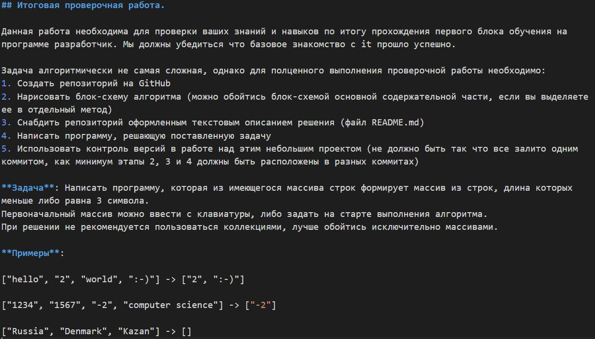

# Контрольня работа/


При решении задачи используется 3 метода:
* `FillArray`  - функция наполнения массива данными.
* `PrintArray` - функция вывода массива.
* `PrintArrayFindStringOfThreeSymbol` - функция посчета длины нового массива и наполнения его данными, соответствующими условию.

# Описание решения:
 1. Пользователю предлагается ввести размер массива. Если пользователь ввел данные неверного типа, он получит сообщение об ошибке за счет оператора **try-catch**. 
 2. Далее оператору предлагается ввести элементы массива поочередно. 
 После ввода каждого элемента, необходимо нажать Enter.
 3. После ввода всех элементов массива, с помощью метода `FillArray` создается массив из введеных элементов.
 4. С помощью метода `PrintArray` созданный массив выводится в терминале.
 5. С помощью метода `PrintArrayFindStringOfThreeSymbol` происходит перебирание элементов входного массива и сравнивание длины каждого элемента с длиной из условия.  
 Ведется счетчик колличества элементов, подходящих под условие. 
 Колличество подходящих элементов является ***длиной выходного массива***.  
  Далее происходит повторное перебирание элементов.  
 Каждый элемент записывается во временную переменную. Далее происходит сравнение переменных с длиной из условия.  
 ```Подходящие элементы записываюся в выходной массив.```
 6. С помощью метода `PrintArray` выводится новый массив в терминале.